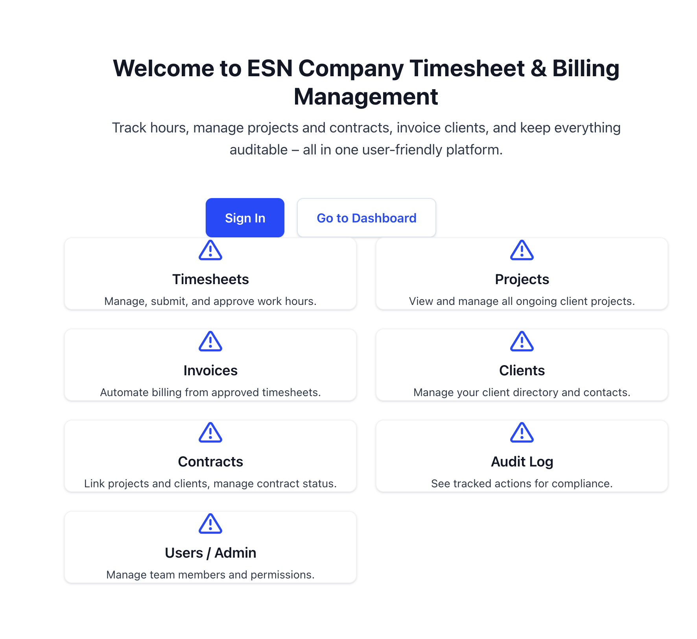

# Onboarding process

## Your mission

- Generate a page based on a json object.
- Based on a json file to import `@/lib/data/tree.json`. You will have to create an engine that will transform this tree as a react page. Here is the expected output: `@/lib/result.png`
  

## Setup
- Clone the project:
  - git clone https://github.com/solinn-dev-app/integration.git
  - git fetch origin
  - git checkout [firstname-lastname]
  
## Why this test
- The main goal of this test, is to visualize how you would solve it.
- I will focus specifically on the resolution of the engine

## Rules
- We ask you for this test, to not use any ai services.
- You have maximum 2 days to push your work

Good luck - 

If you have any questions: sends me an email: julien.moulis@solinn.fr